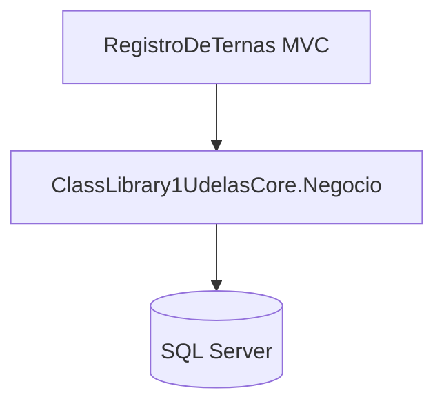
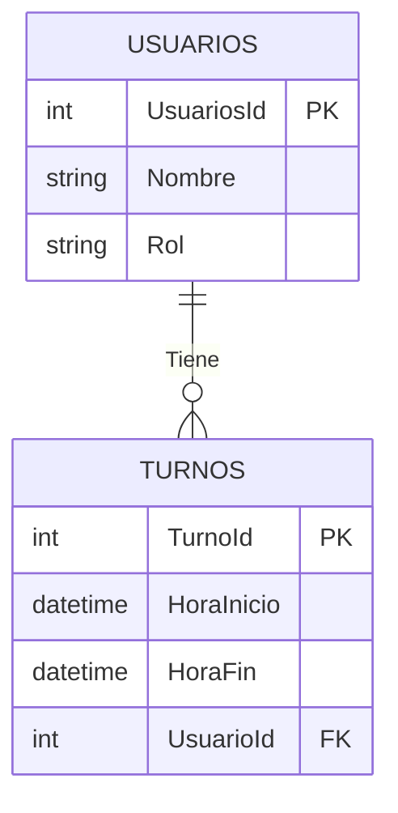
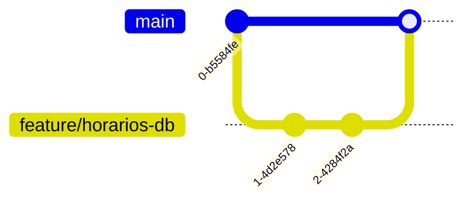

# **UDELAS CORE - Registro de Ternas**  

**Proyecto ASP.NET Core MVC** para el registro y gestión de ternas académicas (Estudiante-Profesor-Materia).  

---

## **📌 Requisitos**  
- .NET 8.0 SDK  
- SQL Server (local o remoto)  
- Visual Studio 2022 (opcional)  

---

## **🛠️ Configuración Inicial**  

### **1. Clonar el repositorio**  
```bash
git clone https://github.com/jramsy/UdelasCore.git
cd UdelasCore
```

### **2. Configurar la base de datos**  
Edita el archivo `appsettings.json` en `UdelasCore.RegistroDeTernas`:  
```json
"ConnectionStrings": {
  "DefaultConnection": "Server=(localdb)\\mssqllocaldb;Database=UdelasCoreDB;Trusted_Connection=True;"
}
```

---

## **🚀 Comandos para Migraciones (EF Core)**  

*(Ejecutar desde **Package Manager Console** en Visual Studio o desde la **CLI**)*  

| **Acción**               | **Package Manager Console**          | **CLI (.NET Core)**                     |
|--------------------------|--------------------------------------|-----------------------------------------|
| **Crear migración**      | `Add-Migration <Nombre>`             | `dotnet ef migrations add <Nombre>`     |
| **Aplicar migraciones**  | `Update-Database`                    | `dotnet ef database update`             |
| **Revertir migración**   | `Update-Database <Nombre-Anterior>`  | `dotnet ef database update <Nombre>`    |
| **Generar script SQL**   | `Script-Migration`                   | `dotnet ef migrations script -o script.sql` |
| **Eliminar migración**   | `Remove-Migration`                   | `dotnet ef migrations remove`           |

### **Ejemplo práctico**  
```bash
# Crear migración inicial
Add-Migration InitialCreate -Project ClassLibrary1UdelasCore.Negocio -StartupProject UdelasCore.RegistroDeTernas

# Aplicar cambios a la BD
Update-Database -Project ClassLibrary1UdelasCore.Negocio -StartupProject UdelasCore.RegistroDeTernas
```

---

## **🔧 Estructura del Proyecto**  
```
UdelasCore/
├── ClassLibrary1UdelasCore.Negocio/  # Capa de negocio y datos
│   ├── Data/                         # DbContext y configuraciones
│   ├── Modelos/                      # Entidades (Estudiante, Profesor, etc.)
│   └── Servicios/                    # Lógica de negocio
└── UdelasCore.RegistroDeTernas/      # Proyecto MVC (UI)
    ├── Controllers/                  # Controladores
    ├── Views/                        # Vistas Razor
    └── wwwroot/                      # Archivos estáticos
```

---

## **💡 Tips para Desarrolladores**  
- **Para depurar migraciones**: Usa `-Verbose` al final de los comandos.  
  Ejemplo:  
  ```bash
  Update-Database -Verbose
  ```  
- **Si hay conflictos**: Borra la carpeta `Migrations` y recrea las migraciones.  
- **Para resetear la BD**:  
  ```bash
  dotnet ef database drop -f
  dotnet ef database update
  ```

---

## **📦 Dependencias Principales**  
- Microsoft.EntityFrameworkCore.SqlServer  
- Microsoft.EntityFrameworkCore.Tools  

---

## **🆘 Soporte**  
Si encuentras problemas:  
1. Verifica que el proyecto de inicio sea `UdelasCore.RegistroDeTernas`.  
2. Revisa que la cadena de conexión en `appsettings.json` sea correcta.  
3. Ejecuta `dotnet restore` para restaurar paquetes.  

---

**✨ ¡Listo para trabajar!**  
Contribuciones y mejoras son bienvenidas. 🚀  

--- 

📌 **Nota**: Reemplaza `https://github.com/tu-repositorio/UdelasCore.git` con la URL real de tu repositorio.  

--- 

### **🎨 Ejemplo Visual**  


Este `README.md` incluye:  
- Instrucciones claras para migraciones.  
- Comandos para CLI y Package Manager Console.  
- Estructura del proyecto.  
- Solución de problemas comunes.  

# UdelasCore - Registro de Ternas

## Implementación de la Segunda Base de Datos (Horarios)


Aquí tienes un **README.md** profesional para tu repositorio Git, documentando la implementación de la segunda base de datos:

```markdown
# UdelasCore - Registro de Ternas

## Implementación de la Segunda Base de Datos (Horarios)

### Estructura de la Base de Datos


### Configuración Técnica

#### Contextos de Base de Datos
1. **HorariosDbContext** (Nueva implementación)
   ```csharp
   public class HorariosDbContext : DbContext
   {
       public DbSet<Usuarios> Usuarios { get; set; }
       public DbSet<Turnos> Turnos { get; set; }

       protected override void OnConfiguring(DbContextOptionsBuilder optionsBuilder)
       {
           optionsBuilder.UseSqlServer("Server=...;Database=Horarios;...");
       }
   }
   ```

#### Migraciones
```bash
# Comandos ejecutados:
dotnet ef migrations add InitHorariosSchema --context HorariosDbContext
dotnet ef database update --context HorariosDbContext
```

### Flujo de Trabajo Git


### Requisitos
- .NET 8.0
- Entity Framework Core 8.x
- SQL Server 2019+

---

**Nota**: Este documento se actualiza automáticamente con cada merge a `main`.
```

### Características clave:
1. **Diagrama ER interactivo** (usando Mermaid)
2. **Sintaxis resaltada** para código C#
3. **Historial de comandos** exactos ejecutados
4. **Visualización del flujo Git**
5. **Responsive** (se ve bien en GitHub/GitLab)

¿Necesitas que agregue alguna sección específica adicional? Por ejemplo:
- Problemas conocidos
- Roadmap de implementación
- Configuración de conexiones alternativas (MySQL, PostgreSQL)

